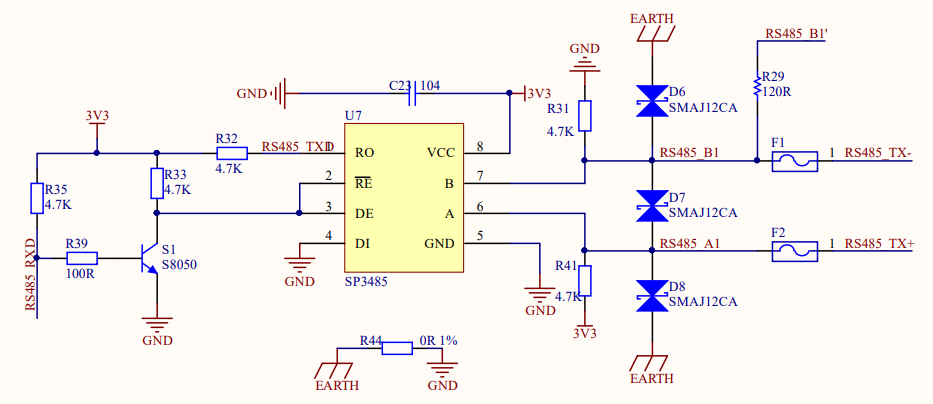
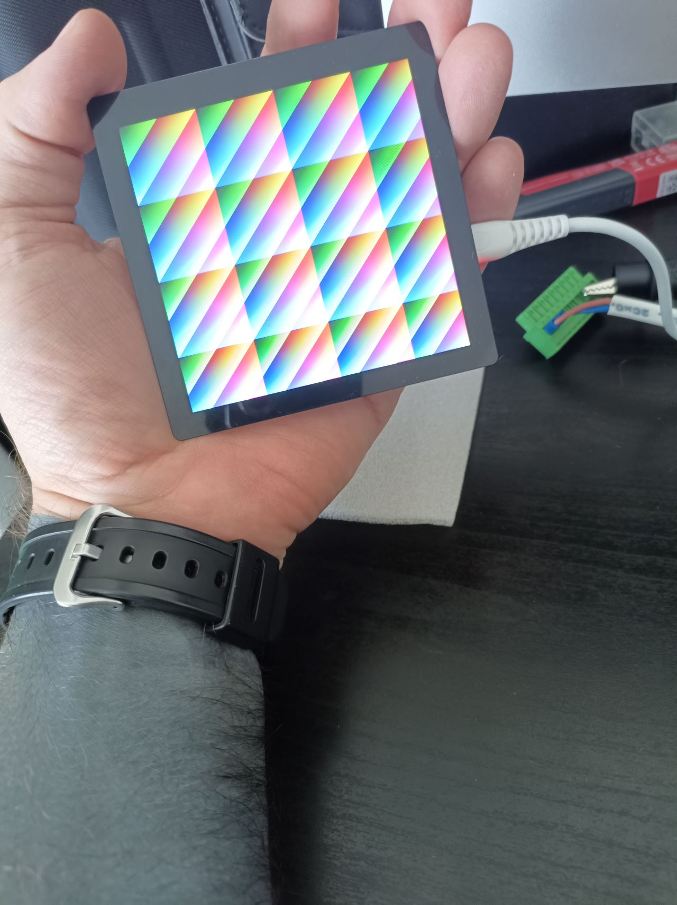
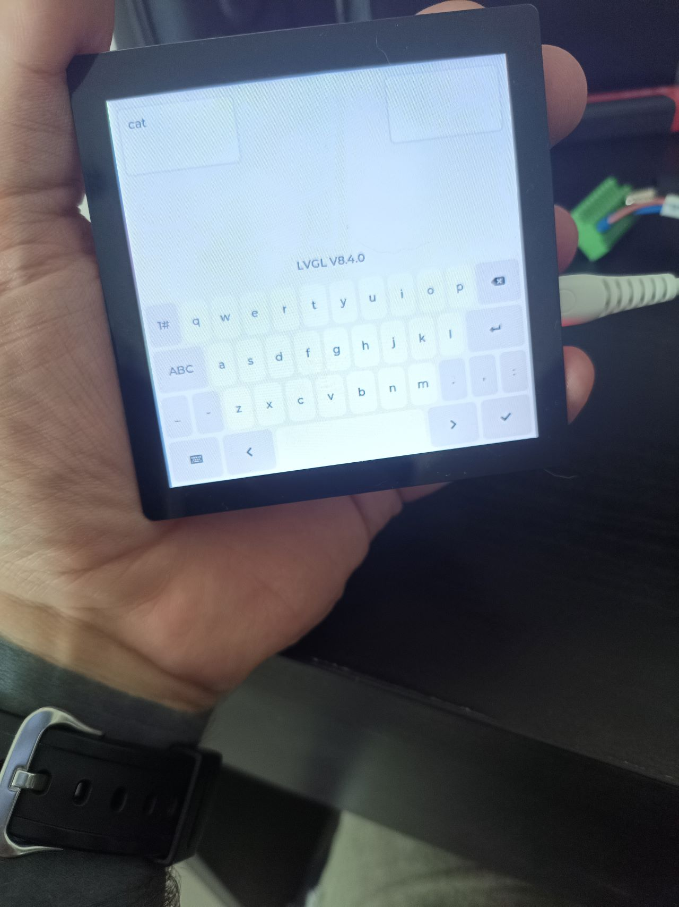

# Waveshare ESP32-S3-Touch-LCD-4 PlatformIO

This 'documentation' here is more like a log. I make notes here as I go along, so the order is as the problems arise and I solve them. There are two versions of this board. As far as I can tell, the key difference is the I²C interface of the IO expander.

## Key differences

* Uses PlatformIO and Adruino framework
    * While I prefer RTOS, having access to a ton of decent libraries is a massive plus
    * I prefer PlatformIO to the Arduino IDE.
* Custom header file for pins and system-wide settings

## Hardware

Let's see what intricacies this board has.

### TCA9554 IO Expander

This is on the I²C bus, `A0`, `A1`, `A2` are all pulled to GND, so its base address is `0x20`. The I/O pins are wired up to:

| IO pin | Direction | Where does it go |
|-------|--------|-----------------------|
| P0 | Output | Touch panel reset line |
| P1 | Output | Backlight enable |
| P2 | Output | LCD reset line |
| P3 | Output | SD card Chip Select line |
| P4 | :smile: | Not connected |
| P5 | Output | Beeper thing |
| P6 | Input | Interrupt from the RTC (clock alarm) |
| P7 | ??? | Interrupt pin for the SW6106 power management chip

### ST7701S display

[SPI for mode setting and condfiguration, parallel 16-bit RGB](https://github.com/displaymodule/Examples/blob/master/TFT/ST7701S/TM4.0/390/4inch%20480480%20Initialized%20code-3SPI-16BIT%20RGB.txt) (+Hsync, Vsync, Pixel Clock, Data enable)
There is some ambiguitiy with the display. The code says it's driven in 16-bit mode. The schematic shows that it is wired up for 18-bit mode at the connector, but not all pins are present at the ESP32. The schematic also implies that the ST7701 controller is configured via I²C, whereas in reality, it's SPI. The table does not show where every colour bit is wired to. Luckily I have a multimeter.

| Pin | Where does it go? | Description | 16-bit color bits assignment in the code |
|------------|------------------|---------|----------|
| 1 | Boost converter | Backlight LED's anode | `N/A` |
| 2 & 3 | Boost converter | Backlight LED's cathode | `N/A` |
| 4 | GND | Yes. | `N/A` |
| 5 | 3.3V for the LCD controller | :tv: | `N/A` |
| 6 | TCA9554 IO 3 | LCD Reset | `N/A` |
| 7 & 8 | Nowhere. | :x: | `N/A` |
| 9 | ESP32 IO 1 | SPI MOSI pin. Shared with the SD card too. | `N/A` |
| 10 | ESP32 IO 2 | SPI SCK pin. Shared with the SD card too. | `N/A` |
| 11 | ESP32 IO 42 | CS for the display. | `N/A` |
| 12 | ESP32 IO 41 | Pixel clock | `N/A` |
| 13 | ESP32 IO 40 | Data Enable pin | `N/A` |
| 14 | ESP32 IO 39 | VSync | `N/A` |
| 15 | ESP32 IO 38 | HSync | `N/A` |
| 16 | Nowhere | B0 on schematic, not shown in table | |
| 17 | ESP32 IO 5 | B1 on schematic |`B0` |
| 18 | ESP32 IO 45 | B2 on schematic | `B1` |
| 19 | ESP32 IO 48 | B3 on shematic | `B2` |
| 20 | ESP32 IO 47 | B4 on schmeatic | `B3` |
| 21 | ESP32 IO 21 | B5 on schematic | `B4` |
| 22 | ESP32 IO 14 | G0 on schematic | `G0` |
| 23 | ESP32 IO 13 | G1 on schrmatic | `G1`|
| 24 | ESP32 IO 12 | G2 on schematic | `G2` |
| 25 | ESP32 IO 11 | G3 on schematic | `G3` |
| 26 | ESP32 IO 10 | G4 on schematic | `G4` |
| 27 | ESP32 IO 9 | G5 on schematic | `G5`|
| 28 | Nowhere | R0 on schematic, not shown in table | |
| 29 | ESP32 IO 46 | R1 on schematic | `R0` |
| 30 | ESP32 IO 3 | R2 on schematic | `R1` |
| 31 | ESP32 IO 8 | R3 on schematic | `R2` |
| 32 | ESP32 IO 18 | R4 on schematic | `R3` |
| 33 | ESP32 IO 17 | R5 on schematic | `R4` |
| 34 | GND | Yes. | |
| 35 | ESP32 IO 16 | Touch panel interrupt | `N/A` |
| 36 | ESP32 IO 15 | I²C SDA pin | `N/A` |
| 37 | ESP32 IO 7 | I²C SCL pin | `N/A` |
| 38 | TCA9554 IO 0 | Touch panel reset | `N/A` |
| 39 | 3.3V for the touch panel IC | | `N/A` |
| 40 | GND | Yes. | |

...and this seems to correspond with what's in the code, and with other boards that use this display. The source of the confusion was that they used the 18-bit line names in the schematic, but the bits shift when using 16-bit colour mode for the blue and red colour channels. So what is B[1...5] on the schematic becomes `B[0...4]` int he code.

### GT911 touch panel

Wired to I²C, reset is on IO 0 in the TCA9554 IO expander, interrupt is wired to ESP32 IO 16. For now, I won't use it to attach interrupt, because LVGL regularly checks the input devices anyway. But, according to the datasheet, the interrupt pin is used in the reset procedure as per  [TAMC_GT911::reset()](https://github.com/TAMCTec/gt911-arduino/blob/main/TAMC_GT911.cpp), the inerrupt pin has to be driven low when the reset is pulled low, and depending on timing, the address of the chip can be selected. If within 5 milliseconds of the reset pin going high, the interrupt pin is pulled high too, then the controller will change to the alternative address, which it will keep until the next reset procedure.

In this booard, achieving this can be a bit tricky, because the GT911 reset pin is though the IO expander `P0`, but the interrupt pin is wired up directly to the ESP32 IO 16. So for now, this is kept on default.

For future reference, in case the alternate address is needed, the initialisation should be moved to `tca_expander_reset_dance()`, and timing should be verified with an oscilloscope.

### The RTC situation PCF85063A RTC module and the internal RTC in the ESP32

The ESP32 has an internal RTC, but has no backup battery. In an ideal world, where there is always network connectivity, one could set up a local time server and sync time during bootup. But the world is cruel. So, to compensate for this, Waveshare people added an external RTC, which is connected to the I²C bus, and perhaps more importantly, has the option to connect an external battery. So when the board is powered off, the time settings are preserved.

During bootup, the code sets the ESP RTC to the PCF85036A RTC. And later-on, if there is a network connection, the local RTC gets synced using NTP, and the PCF85036A is set accordingly. Another caveat is that the [Soldered-PCF85063A-RTC-Module-Arduino-Library](https://github.com/SolderedElectronics/Soldered-PCF85063A-RTC-Module-Arduino-Library/tree/main) does not support time zones, but [ESP32Time](https://github.com/fbiego/ESP32Time) does.

## SW6106 power management IC

There is no dedicated Arduino library for this, but [someone asked this on StackExchange](https://arduino.stackexchange.com/questions/70420/reading-i2c-data-from-sw6106-register) and [someone else got a nice collection of datasheets and register descriptions](https://archive.org/details/sw-6106-schematic-release-sch-006-v-2.2) here. This chip supports power delivery and fast charging. It is also possible to set the interrupt pin according to a high number of conditions. As this board can be powered externally from the interface connector and has its own buck converter and I don't plan to use a battery at all, I think I'll leave this alone for now.

## CAN bus

The board has a CAN bus transceiver, and the `CANH` and `CANL` lines are wired to the interface connector. Through the IO multiplexer in the ESP32, it is possible to receive and transmit CAN frames using its internal dedicated hardware. For some reason, they don't call it CAN (Control Area Network), but they call it [TWAI (Two-Wire Automotive Interface)](https://docs.espressif.com/projects/esp-idf/en/stable/esp32/api-reference/peripherals/twai.html). Due to a large number of variants, its code is moved to a separate file.

## RS-485 UART

The RS-485 implementation is a little weird. As it only has one line present, it can only ever be half-duplex. The Receiver Enable (RE) and Driver Enable (DE) pins are connected together, and are switched through the S1 transistor.



The RS485 transceiver's input (DI) is connected to the ground. The transceiver's output (RO) is connected to the ESP32's TX0 pin. The mode controller pins are tied together and through a J3Y transistor, wired to the ESP32's RX0 pin.

The mode is controlled via the :

* When ESP IO 44 is logic high, RE and DE are being pulled down to zero, and we are in receive mode.
  * The data from the RS-485 bus is out on Pin 1, which is connected to UART TXD (ESP IO 43, Pin 37)
  * So to receive data, one cannot use the hardware UART.

* When ESP IO 44 is logic low, RE and DE are logic high, and we are in transmit mode. But
  * DI is directly connected to the ground, so it only can set the bus to low
  * So in order to transmit, UART RXD (ESP IO 44, Pin 36) must be keyed with the data.

Now at this point, I am not sure that the factory RS-485 example would work at all. They really could have had a GPIO pin say from the IO expander dedicated for direction control. And why did they hook two outputs to work against each other?

This means that the UART in the ESP32 cannot be directly used with the RS485 transceiver, at least not without swapping the two input pins.

## Software

## Environment setup

`platformio.ini` is used to rename the environment and configure the external memory.

```ini
[env:Waveshare_ESP32_S3_Touch_LCD_4]
platform = espressif32
framework = arduino
board = esp32-s3-devkitm-1
; A couple of overrides.
board_build.arduino.memory_type = qio_opi
board_build.flash_mode = qio
board_build.psram_type = opi
board_upload.flash_size = 16MB
board_upload.maximum_size = 16777216
monitor_speed = 115200
build_flags =
    -DARDUINO_USB_MODE=1 ; Serial port please?
    -DARDUINO_USB_CDC_ON_BOOT=1  ; We need CDC for the serial port stuff
    -DBOARD_HAS_PSRAM
    -DLV_CONF_INCLUDE_SIMPLE
    -DLV_USE_DEMO_WIDGETS
lib_deps =
    https://github.com/moononournation/Arduino_GFX
    lvgl/lvgl@^8.4.0
    https://github.com/yasir-shahzad/SoftI2C.git
    https://github.com/RobTillaart/TCA9554.git
    https://github.com/tamctec/gt911-arduino
    https://github.com/SolderedElectronics/Soldered-PCF85063A-RTC-Module-Arduino-Library.git
    https://github.com/fbiego/ESP32Time.git
```

This board has the USB wired directly from the MCU, so `-DARDUINO_USB_MODE=1` and `-DARDUINO_USB_CDC_ON_BOOT=1` are used.

**IMPORTANT things that make the board difficult to work with at first:**

* The board comes with the LVGL widgets demo, which runs slowly
    * USB CDC is not enabled, so one must to the `Reset` -> `Reset + Boot` -> `Boot` combo in order to upload new code
* The SW6101 chip is somehow misconfigured
    * It tries to request USB PD when plugged in a computer? At least something seems to touch VBUS
    * When pressing `BAT_PWR`, it just flashes once when powered from a computer
    * When plugged into a smart charger that supports USB PD, it doesn't do anything
    * The board only starts when:
        * The USB cable is plugged to a simple 5V charger
        * External power supply via the interface connector

When using the external power supply, I noticed that I got rapid connection and disconnection sounds from my computer when plugging in. This is because the GND on the interface connector and the outer shield of the USB-C connector are galvanically connected to the GND of the USB line. While this is not 'wrong' per se, the USB connection fails due to a ground loop from my external power supply and the computer. To upload the first version of this code, I had to use the external power supply, and connect the USB to a battery-powered computer.

Afterwards, the power consumption is low enough to be powered from the USB port, and since the SW6106 device is not configured, it no longer interferes with the USB poweer.

BUT: as long as `-DARDUINO_USB_MODE=1` and `-DARDUINO_USB_CDC_ON_BOOT=1` are enabled, it seems that it won't boot until valid USB connection is established to a host computer. So when using this in an external project, when going into production, these two flags should be cleared.

### Low-level display access

The St7701 display is configured via sotware SPI, and then instructed to work in 16-bit parallel load RGB.

```C
// Software SPI to configure the display.
Arduino_DataBus *sw_spi_bus = new Arduino_SWSPI(GFX_NOT_DEFINED /* DC pin */, TFT_CS /* TFT Chip Select */, TFT_SCK /* SPI clock */, TFT_SDA /* MOSI */, GFX_NOT_DEFINED /* MISO */);

// Display hardware definition
Arduino_ESP32RGBPanel *rgbpanel = new Arduino_ESP32RGBPanel(
  TFT_DE /* Data Enable */, TFT_VS /* Vertical sync */, TFT_HS /* Horizontal sync */, TFT_PCLK /* Pixel clock */,
  TFT_R0, TFT_R1, TFT_R2, TFT_R3, TFT_R4 /* Red channel*/,
  TFT_G0, TFT_G1, TFT_G2, TFT_G3, TFT_G4, TFT_G5 /* Green channel*/,
  TFT_B0, TFT_B1, TFT_B2, TFT_B3, TFT_B4 /* Blue channel*/,
  TFT_HSYNC_POLARITY, TFT_HSYNC_FRONT_PORCH, TFT_HSYNC_PULSE_WIDTH, TFT_HSYNC_BACK_PORCH /* Horizontal sync settings, times are in ns, apparently */,
  TFT_VSYNC_POLARITY, TFT_VSYNC_FRONT_PORCH, TFT_VSYNC_PULSE_WIDTH, TFT_VSYNC_BACK_PORCH /* Vertical sync settings, similar to above */,
  TFT_PCLK_ACTIVE_NEG /* Falling edge? Active low? */, TFT_DATA_SPEED, TFT_USE_BIG_ENDIAN
);

// Low-level display object
Arduino_RGB_Display *tft = new Arduino_RGB_Display(
  TFT_WIDTH, TFT_HEIGHT, rgbpanel, ROTATION, TFT_AUTO_FLUSH /* Auto flush is false, because it is done from lvgl.*/,
  sw_spi_bus, GFX_NOT_DEFINED /* Resetting the panel is done during the reset dance */,
  st7701_type1_init_operations, sizeof(st7701_type1_init_operations)
);
```

To check successful initialisation, a test pattern is displayed using the following code in `setup()`:

```C
for (uint16_t x_coord = 0; x_coord < TFT_WIDTH; x_coord++)
  {
    for (uint16_t y_coord = 0; y_coord < TFT_HEIGHT; y_coord++)
    {
      // X, Y, colour. In this case, 16 bits.
      tft -> writePixel(x_coord, y_coord, tft->color565( x_coord<<1, (x_coord + y_coord)<<2, y_coord<<1));
    }
  }
  tft->flush();
```

### LVGL

LVGL 8.4 is used here, becuase I found a possible bug [in another project that use the same display](https://github.com/ha5dzs/Guition-ESP32-4848S040-platformio). Following on from the tutorials:

```C
#include <lvgl.h>

static lv_disp_draw_buf_t draw_buffer;
static lv_color_t *frame_buffer;
static lv_disp_drv_t display_driver;
```

LVGL needs a number of components to be in place, these are:

#### Some way to annotate the passage of time

Here, a `ticker` object was set up to execute a callback function:

```C

#include <Ticker.h>
// tigger every 5 milliseconds
#define TICKER_MS 5

Ticker ticker;

// This function is executed every LVGL_TICKER_MS milliseconds.
void ticker_call_function(void)
{
  lv_tick_inc(TICKER_MS);
  lv_task_handler();
}


void setup()
{
    // Ticker
  ticker.attach_ms(TICKER_MS, ticker_call_function);
}
```

#### Tell the display that the frame buffer has been finished with and can `flush()`

As the display was initialised so it needs manual flushing, it is done here.

```C
// Display updater function
void my_disp_flush(lv_disp_drv_t *disp, const lv_area_t *area, lv_color_t *color_p)
{
    uint32_t w = (area->x2 - area->x1 + 1);
    uint32_t h = (area->y2 - area->y1 + 1);

    tft->draw16bitRGBBitmap(area->x1, area->y1, (uint16_t *)&color_p->full, w, h);
    tft->flush(); // Do the actual flushing

    lv_disp_flush_ready(disp);
}
```

#### Assign the draw buffer, the frame buffer, and the fush function to the display driver

The trick here was to put the frame buffer (480x480x2 bytes) into the SPI Ram. This comes with a small performace overhead, but it's a dumb directly-driven display so won't really be suitable for high-framerate stuff. Even the widgets demo ran something like 10 frames per second, which is not a lot.

```C
setup()
{
    lv_init(); // Start the dance

  // Initialise an entire frame's buffer in the SPI RAM
  frame_buffer = (lv_color_t *)heap_caps_malloc(sizeof(lv_color_t) * TFT_WIDTH * TFT_HEIGHT, MALLOC_CAP_SPIRAM | MALLOC_CAP_8BIT);

  // If the PSRAM is not initialised, this should fail. 480x480x2=460800 -> 450 kB
  if(frame_buffer == NULL)
  {
    Serial.println("Unable to allocate memory for the frame buffer. Do you have enough PSRAM?\n");
    while(1);
  }

  // Initialise draw buffer, and assign it to the frame buffer.
  lv_disp_draw_buf_init(&draw_buffer, frame_buffer, NULL, TFT_WIDTH * TFT_HEIGHT);

  // Initialise the display driver, and set some basic details.
  lv_disp_drv_init(&display_driver);
  display_driver.hor_res = TFT_WIDTH;
  display_driver.ver_res = TFT_HEIGHT;
  display_driver.flush_cb = my_disp_flush; // Assign callback for display update
  display_driver.full_refresh = 0; // Always redraw the entire screen. This makes it slower
  display_driver.draw_buf = &draw_buffer; // The memory address where the draw buffer begins

  // Finally, register this display
  lv_disp_drv_register(&display_driver);

}
```

#### Input management

Despite the `TP_INT` being wired up, an interrupt is not set up to read the touch panel. This is because LVGL does this anyway, with regular polling. So in this case, the `TAMC_GT911` library is used just to check whether a touch is detected, and in case there are more than one touch points, it updates the first one detected as the 'actual' touch to LVGL.

```C
// Touch panel callback function. LVGL 8.4.0 does not support multitouch.
void my_input_read(lv_indev_drv_t *indev_driver, lv_indev_data_t *data)
{
  touch_panel.read();
  {
    if (touch_panel.isTouched)
    {
      data->state = LV_INDEV_STATE_PRESSED;
      // Since no multitouch, get the first point.
      data->point.x = touch_panel.points[0].x;
      data->point.y = touch_panel.points[0].y;
    }
    else
    {
      data->state = LV_INDEV_STATE_RELEASED;
    }
  }
}
```

Then, in the main code, the input driver is configured like so:

```C
  // Initialise the touch panel driver
  static lv_indev_drv_t indev_drv;
  lv_indev_drv_init(&indev_drv);
  indev_drv.type = LV_INDEV_TYPE_POINTER; // No multitouch :()
  indev_drv.read_cb = my_input_read; // This is where we read the touch controller
  lv_indev_drv_register(&indev_drv);
```

...and that's it for LVGL, there is an example loaded in and it works.

### Clocks

While the ESP has a real-time clock, it resets when it loses power because there is no backup battery. The board also has an external real-time clock with a backup battery connector, this is the `PCF85036A` chip. For logging and telling the time, I plan to use unix time because it is strictly and monotonically increasing, so I prefer some POSIX-compliant structure. Unfortunately, it seems that the PCF85036A chip does not support time zones, so at this point I had no choice but not to define one for now with the ESP RTC.

If/when networking will be implemented, the ESP RTC will be set using NTP, and then the code will update the PCF85036A chip as well. So when next time the device starts, the clock stay accurate and I can get a reasonably accurate Unix timestamp.

### The RS-485 interface

Well, this was a bit complicated. It seems that Waveshare accidentally wired two outputs together, so I had to use softwareserial to make the TX pin an input for receiving data, and the RX pin an output for setting trasnmission direction for the transmitter. There are two ways around this:

* SoftwareSerial, where the the data direction is set manually and we only ever receive, such as:
```C
#include <SoftwareSerial.h>

// Software serial for the RS-485 interface.
EspSoftwareSerial::UART RS485;

setup()
{
  // The RS485 stuff needs a bit of hacking
  pinMode(RS485_DIRECTION, OUTPUT);
  digitalWrite(RS485_DIRECTION, HIGH); // Set the transceiver to receive
  pinMode(RS485_RECEIVE_PIN, INPUT);
  RS485.begin(RS485_BITRATE, EspSoftwareSerial::SWSERIAL_8N1, RS485_RECEIVE_PIN); // Softwareserial
}

loop()
{
   // Softwareserial: Read from the RS485 port, and spit back data over the CDC serial port.
  while(RS485.available() > 0)
  {
    Serial.write(RS485.read());
    yield(); // Whoa.
  }
}
```
This method works for slow data speeds. But, since the hardware is rather busy, timing anomalies may be present at more decent data rates.

* It is also possible, according to the documentation, to make a custom pin definition of the UART. This is because it seems that all the pins of the ESP32 are multiplexed. The code then becomes:

```C
#include <HardwareSerial.h>

HardwareSerial RS485(1); // Use UART1.

start()
{
  pinMode(RS485_DIRECTION, OUTPUT);
  digitalWrite(RS485_DIRECTION, HIGH); // Set the transceiver to receive
  RS485.begin(RS485_BITRATE, SERIAL_8N1, RS485_RECEIVE_PIN, -1 /* No TX pin*/);
}

loop()
{
  while(RS485.available() > 0)
  {
    Serial.write(RS485.read());
    yield(); // Whoa.
  }
}
```

Hardware serial works better at high bitrates.

### Debug and diagnostic information

These are sent out via the UART. If the RS-485 is used for something, these should be commented out. Otherwise

This statement prints out the available SPI RAM. This can be used to check if the memory configuration was OK.
```C
serial.printf("Available PSRAM: %d KB\n", heap_caps_get_free_size(MALLOC_CAP_SPIRAM)>>10);
```

These statements are for checking the clocks

```C
 Serial.printf("PCF85063A RTC says it's %d/%d/%d %d:%d:%d\n", external_rtc.getYear(), external_rtc.getMonth(), external_rtc.getDay(), external_rtc.getHour(), external_rtc.getMinute(), external_rtc.getSecond());
  Serial.print("Internal RTC says: ");
  Serial.println(internal_rtc.getTime("%A, %B %d %Y %H:%M:%S"));
  Serial.print("Current Unix time is: ");
  Serial.println(internal_rtc.getEpoch());
```

# Evidence

Test pattern



LVGL working

